# @resciencelab/dither-cli

Agent-native image and video dithering from the terminal — powered by [dithermark](https://github.com/allen-garvey/dithermark)'s algorithms.

Sub-second per image. No browser, no Playwright, no WebGL. Pure Node.

## Install

```bash
npm i -g @resciencelab/dither-cli
```

## Quick start

```bash
# One-shot with preset
dither apply photo.jpg -o out.png --preset gameboy

# Custom algorithm + palette + filters
dither apply photo.jpg -o out.png \
  --mode color \
  --algorithm atkinson \
  --palette ocean \
  --colors 8 \
  --color-comparison oklab \
  --brightness 110 \
  --contrast 120

# Black & white dithering
dither apply photo.jpg -o out.png --mode bw --algorithm floyd-steinberg

# Batch a folder in parallel
dither batch "shots/*.jpg" -o dithered/ --preset newsprint --concurrency 4

# Video (requires ffmpeg)
dither video in.mp4 -o out.mp4 --preset comic-book --fps 24
```

## Showcase: 20 looks from one frame

Source image: `2001太空漫游-旋转空间站.png`

### Source


### 20-result contact sheet

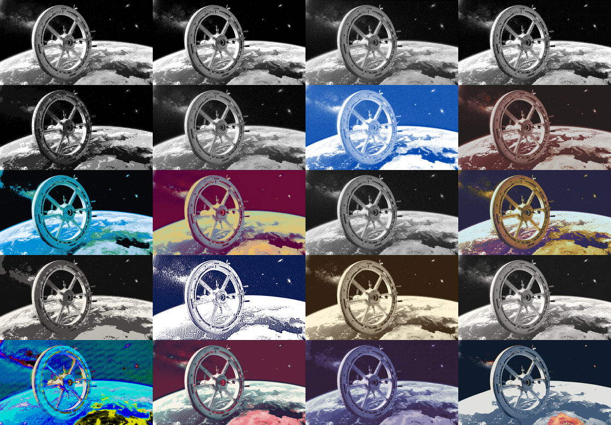

### Example recipes

| # | Output | Recipe |
|---|---|---|
| 01 | 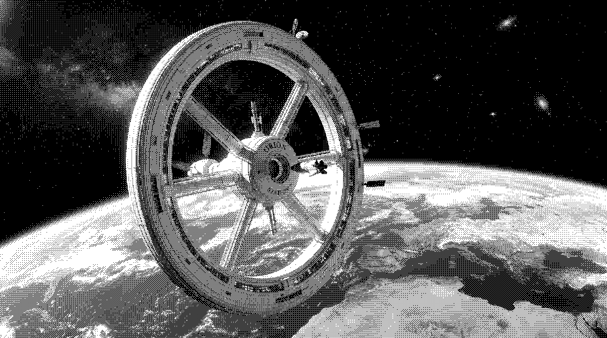 | `--preset gameboy` |
| 02 |  | `--preset mac-classic` |
| 03 |  | `--preset c64` |
| 04 |  | `--preset newsprint` |
| 05 | 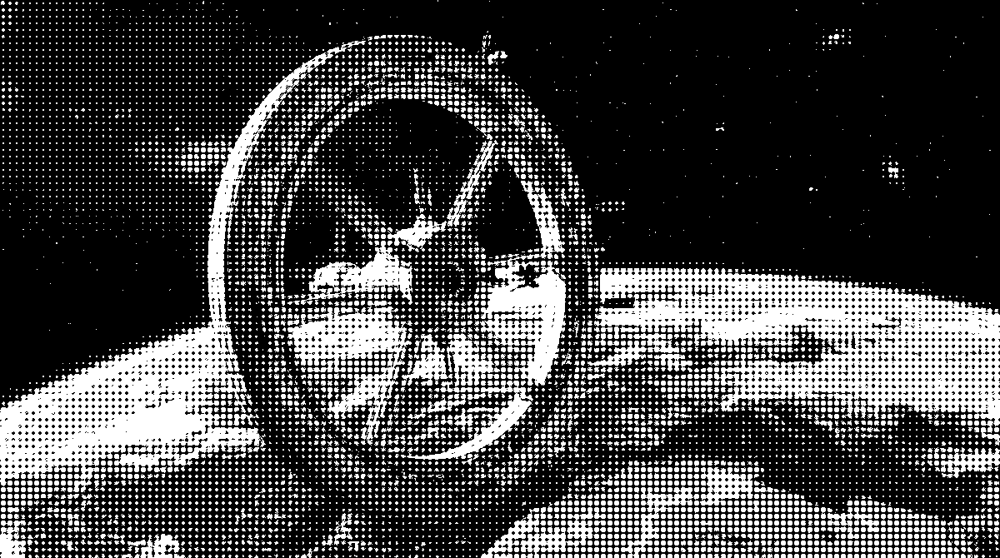 | `--preset risograph` |
| 06 | 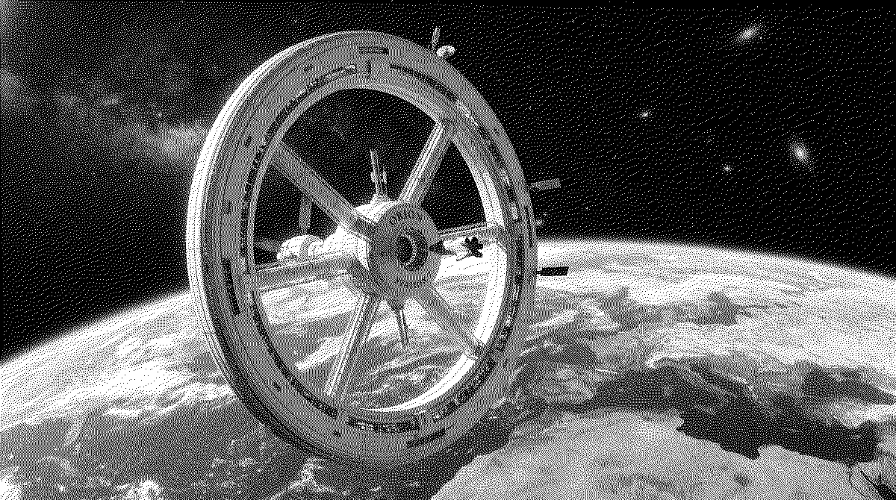 | `--preset neon` |
| 07 |  | `--mode color --algorithm ordered--bayer-16 --colors 2 --custom-colors "#0047ab,#ffffff" --color-comparison cie-lab` |
| 08 |  | `--mode color --algorithm ordered--bayer-8--hl --palette sepia --colors 6 --color-comparison hue-lightness --contrast 118` |
| 09 |  | `--mode color --algorithm ordered--blueNoise-16--stark --palette ocean --colors 8 --color-comparison oklab --saturation 110` |
| 10 | 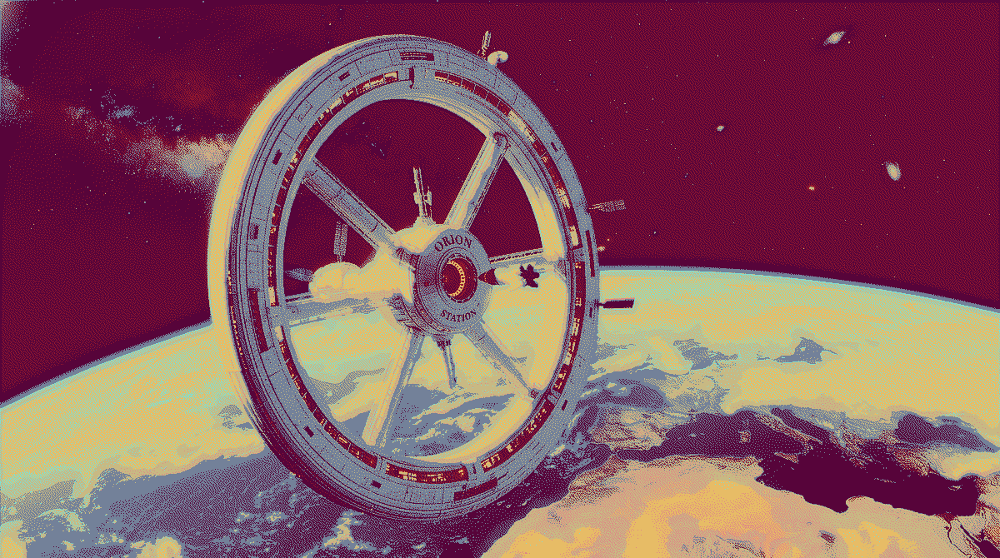 | `--mode color --algorithm stucki --palette wildberry --colors 12 --color-comparison cie-lab --contrast 112 --brightness 104` |
| 11 | 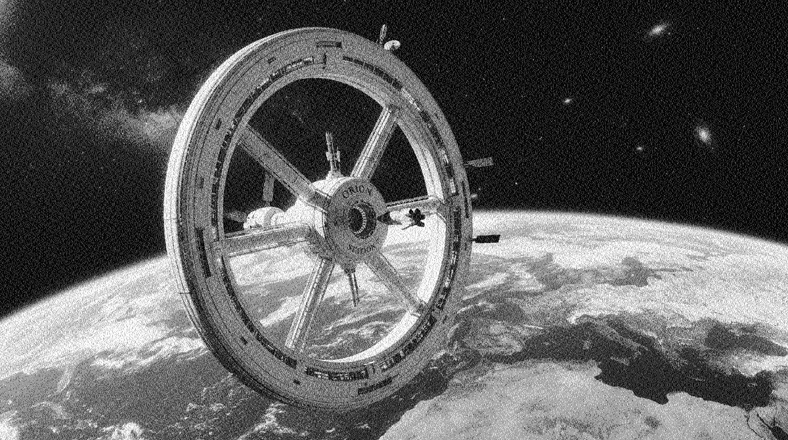 | `--mode color --algorithm xor--medium --palette mondrianchromatic --colors 8 --color-comparison rgb` |
| 12 | 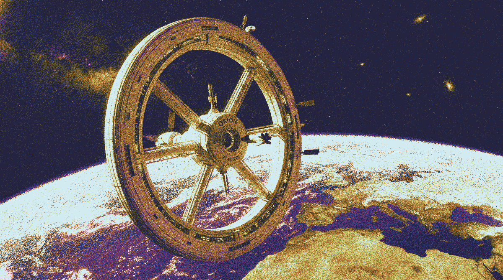 | `--mode color --algorithm simplex --palette galaxy --colors 10 --color-comparison oklab-taxi --hue-rotation 18` |
| 13 | 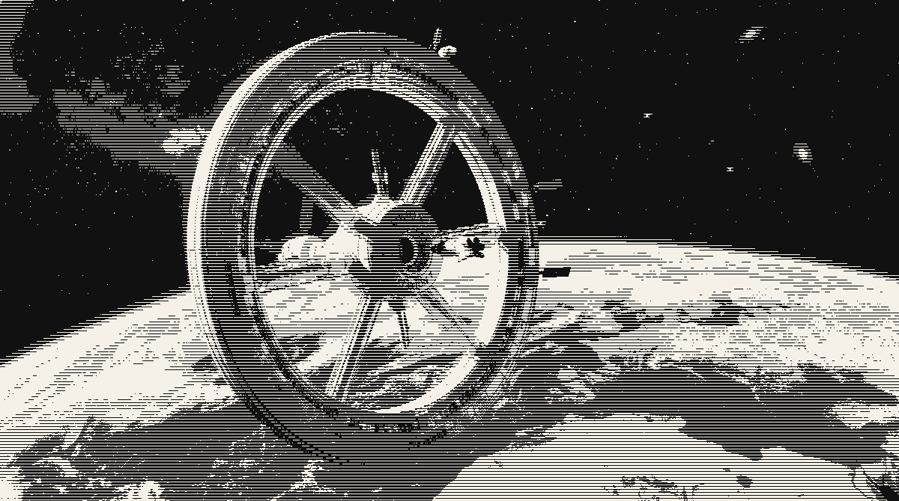 | `--mode bw --algorithm ordered--hatchHorizontal-4 --black-color "#111111" --white-color "#f5f1e8" --contrast 130` |
| 14 | 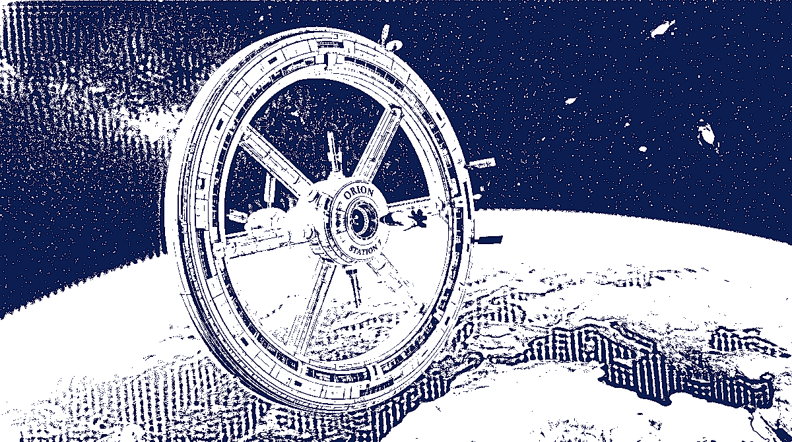 | `--mode bw --algorithm adaptive-threshold --black-color "#0b1d51" --white-color "#ffffff" --blur-before 0.5 --sharpen-after 1.1` |
| 15 | 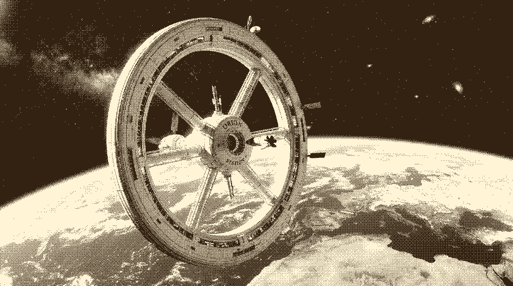 | `--mode bw --algorithm ordered--bayer-8 --black-color "#332211" --white-color "#fff4d6" --brightness 108 --contrast 122` |
| 16 |  | `--mode bw --algorithm atkinson --black-color "#1a1a1a" --white-color "#fdfbf5" --sharpen-before 1.2` |
| 17 | 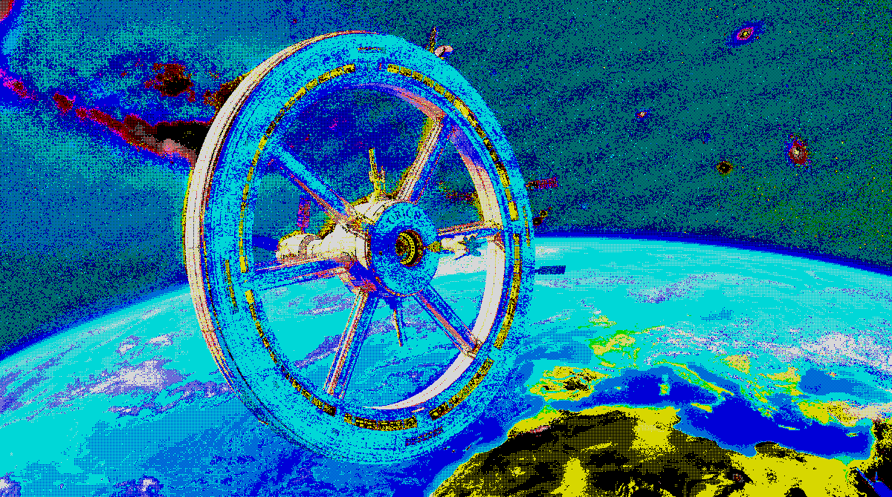 | `--mode color --algorithm ordered--bayer-2 --custom-colors "#000000,#0000d7,#d70000,#d700d7,#00d700,#00d7d7,#d7d700,#d7d7d7" --colors 8 --color-comparison hue --saturation 125` |
| 18 | 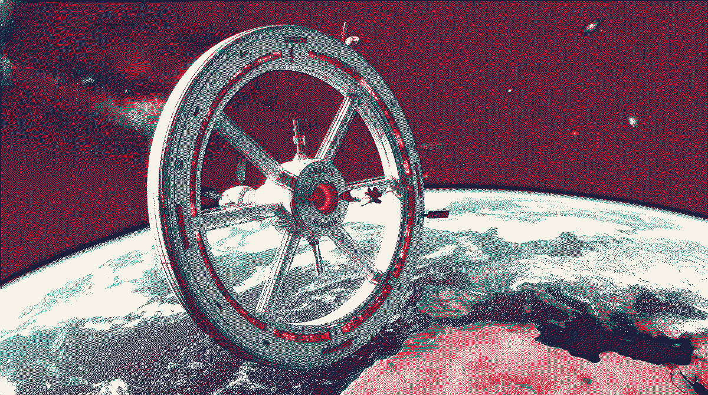 | `--mode color --algorithm floyd-steinberg --custom-colors "#1b1f3b,#f7f3e9,#d7263d,#1b998b" --colors 4 --color-comparison cie-lab --contrast 120` |
| 19 | 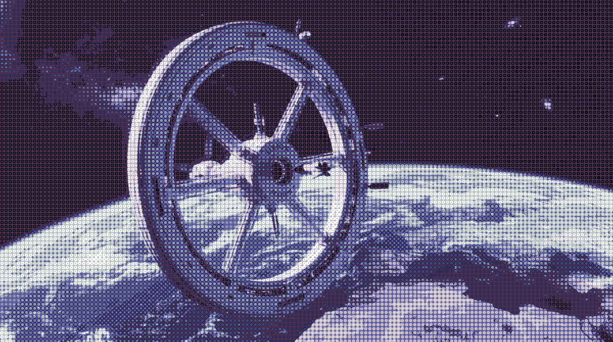 | `--mode color --algorithm ordered--dot-8--hl --palette lilac --colors 6 --color-comparison weighted-hsl --blur-before 0.8 --blur-after 0.3` |
| 20 | 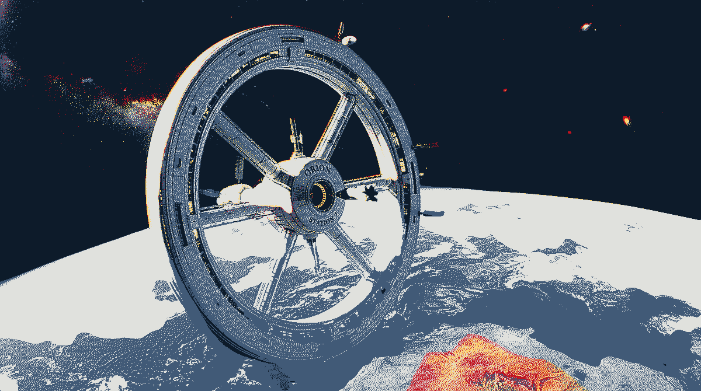 | `--mode color --algorithm burkes --custom-colors "#0d1b2a,#415a77,#e0e1dd,#c1121f,#ffd166" --colors 5 --color-comparison cie-xyz --sharpen-before 1.8 --contrast 125` |

## Presets

10 curated presets covering classic dither aesthetics:

| Preset | Mode | Description |
|--------|------|-------------|
| `gameboy` | color | Classic Game Boy green palette, Bayer 4x4 |
| `mac-classic` | bw | Macintosh classic 1-bit, Atkinson dithering |
| `c64` | color | Commodore 64 palette, Floyd-Steinberg |
| `gameboy-pocket` | color | Game Boy Pocket grayscale, Bayer 8x8 |
| `comic-book` | color | Halftone dots with limited palette |
| `newsprint` | bw | Black & white halftone newspaper |
| `zx-spectrum` | color | ZX Spectrum 8-color palette, Bayer 2x2 |
| `risograph` | color | Risograph 3-color spot print look |
| `thermal-print` | bw | Thermal receipt printer, horizontal hatch |
| `neon` | color | Vibrant neon palette, Floyd-Steinberg |

```bash
dither preset list              # list all presets
dither preset inspect gameboy   # show preset details
```

## Algorithms

30+ dither algorithms across BW and color modes:

- **Error diffusion**: Floyd-Steinberg, Atkinson, Stucki, Burkes, Sierra 1/2/3, Reduced Atkinson
- **Ordered**: Bayer 2x2/4x4/8x8/16x16, Halftone, Dot patterns
- **Other**: Threshold, Random, Closest Color

```bash
dither info algorithms          # list all algorithms
dither info algorithms --bw     # BW only
dither info algorithms --color  # color only
```

## Palettes

31 built-in color palettes:

```bash
dither info palettes            # list all palettes
dither palette preview sepia    # ASCII preview
dither palette export sepia --format json  # export as JSON
```

## Color comparison

4 color comparison methods for finding closest palette matches:

| Method | Description |
|--------|-------------|
| `rgb` | Euclidean RGB distance (default) |
| `luma` | Weighted luma-aware distance |
| `lightness` | HSL lightness comparison |
| `oklab` | Perceptual OKLab distance (best quality) |

## Filters

Apply pre-dither image adjustments:

```bash
dither apply photo.jpg -o out.png --preset gameboy \
  --brightness 110 \
  --contrast 120 \
  --saturation 80 \
  --pixelate 2
```

## Config files

Save your recipe as JSON and reuse it:

```json
{
  "name": "my-recipe",
  "mode": "color",
  "algorithm": "atkinson",
  "palette": "ocean",
  "colors": 8,
  "colorComparison": "oklab",
  "filters": {
    "brightness": 110,
    "contrast": 120,
    "saturation": 100,
    "pixelate": 1
  }
}
```

```bash
dither apply photo.jpg -o out.png --config my-recipe.json
```

## Video

Requires `ffmpeg` on PATH. Decomposes video into frames, dithers each in parallel, recomposes.

```bash
dither video in.mp4 -o out.mp4 --preset mac-classic --fps 24 --concurrency 4
```

## License

MIT
